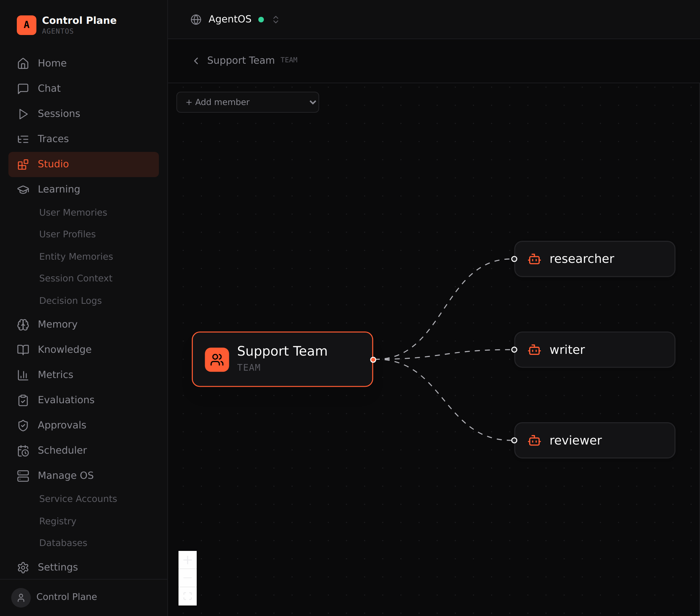

# AgentOS Control Plane

[](https://github.com/djalmaaraujo/agentos-control-plane/actions/workflows/ci.yml)

A self-hosted control plane for [AgentOS](https://docs.agno.com/agent-os/overview).
It's a single-page React app that talks to the AgentOS REST API directly from the
browser — a lightweight, open alternative to the hosted dashboard.

Built with Vite + React + TypeScript + Tailwind. No backend of its own: a thin
proxy serves the app and forwards `/api` to your AgentOS runtime.



## Features

- **Home** — agents, teams, workflows and interfaces as cards; open a chat or a
  config drawer (model, tools, instructions, history) for any component.
- **Chat** — stream a run (SSE) against an agent, team or workflow, with markdown
  replies, live tool calls (arguments + result), reasoning, workflow steps, and
  resume / rename / delete of past sessions.
- **Sessions** — every session with a tabbed detail (conversation with inline
  attachments/media, token metrics, metadata).
- **Traces** — spans as a tree or a time-axis timeline (agent / team / model /
  tool), with per-span input, output and metadata, plus a server-side filter
  builder (status, ids, …).
- **Studio** — build, version and publish agents, teams and workflows at runtime
  with a guided form (model, instructions, tools, members, mode, history) or raw
  config JSON; teams and workflows get a visual canvas (React Flow) — members and
  steps as a graph you can edit — config versions you can set current, and an
  **API access** panel (REST + MCP snippets) on published components. Your
  code-defined components show read-only alongside the Studio-authored ones.
- **Learning** — user memories, profiles, entity memories, session context and
  decision logs; edit or delete entries.
- **Memory** — stored memories with search; create, edit, delete and optimize.
- **Knowledge** — documents per knowledge base; add content (text / URL / file),
  semantic search, refresh and delete.
- **Metrics** — per-metric charts (tokens, users, runs, sessions, model mix), a
  month picker and a recalculate action.
- **Evaluations** — launch accuracy / reliability / judge / performance runs and
  review the tool-call / judge breakdown; delete runs.
- **Approvals** — tool calls waiting for a human; approve or reject.
- **Scheduler** — create and edit cron schedules; run history; enable, disable,
  trigger.
- **Manage OS** — service accounts (scoped machine tokens), the build registry,
  and database migrations.
- **Settings** — OS info, server switcher, access, interfaces, databases, models.

Plus a **multi-server switcher**, a **⌘K command palette**, and an optional
**login gate**.

## How it talks to AgentOS

The browser calls a same-origin `/api/*`. A thin proxy (the Vite dev server in
development, nginx in the container) forwards `/api` to the AgentOS runtime and
adds the `Authorization: Bearer <OS_SECURITY_KEY>` header, so the API key stays
in the proxy and never reaches the browser.

```
browser → /api/config → proxy (adds Bearer, checks login) → AgentOS → /config
```

### Login gate

Set `CP_AUTH_TOKEN` to require a password. The login screen stores it and sends
it as `X-CP-Auth` on every `/api` call; nginx returns 401 without it, so the API
is protected even though the SPA is public. Empty `CP_AUTH_TOKEN` disables it.

## Service accounts & scopes

AgentOS auth is at the OS level — there is no per-agent token. To let a machine
(CI, a chat app, another agent) call the API, you mint a **service account**: an
opaque `agno_pat_…` token (GitHub-PAT model — only its SHA-256 is stored, the
plaintext is shown once, revocation is native).

**Manage OS → Service Accounts → Add account** creates one. Two scope modes:

- **Default** — run + read: `agents:run`, `teams:run`, `workflows:run`,
  `sessions:read`, `config:read`.
- **Custom** — build the exact grant:
  - **Run access** — any agent/team/workflow (`agents:run`), or one component
    (`agents:<id>:run`, `teams:<id>:run`, `workflows:<id>:run`).
  - **Data & admin** — `read` / `write` / `delete` per resource (sessions,
    memories, learnings, knowledge, metrics, evals, traces, …), plus full
    `agent_os:admin`.

Privileged scopes (any `write`/`delete`, `service_accounts:*`, or admin) are
flagged and minted with `allow_privileged_scopes`. The token then authenticates
as `Authorization: Bearer agno_pat_…`, and the OS enforces the scopes:

```bash
# a token scoped to agents:<id>:run runs only that agent
curl -X POST "$AGENTOS_URL/agents/<id>/runs" \
  -H "Authorization: Bearer agno_pat_…" -F "message=hi"
# any other agent → 403 Insufficient permissions
```

The account list shows each token's scopes; revoked tokens are hidden.

The other credentials are the shared **`OS_SECURITY_KEY`** (full access, injected
by the proxy) and **JWT** — generate an RS256 verification keypair in
**Settings → Authorization**.

## Quick start

```bash
cp .env.example .env      # set OS_SECURITY_KEY (and optionally CP_AUTH_TOKEN)
npm install
npm run dev               # http://localhost:5173, proxies /api to AGENTOS_URL
```

Other scripts: `npm test`, `npm run typecheck`, `npm run lint`, `npm run build`.

## Run with Docker

The container serves the built SPA and proxies `/api` to your AgentOS runtime.

```bash
cp .env.example .env
docker compose up -d --build
```

It listens on host port **8810** (`8810 → 80`).

| Env | Default | What it is |
| --- | --- | --- |
| `AGENTOS_UPSTREAM` | `http://host.docker.internal:8000` | AgentOS runtime, from the container |
| `OS_SECURITY_KEY` | *(empty)* | Shared bearer for the REST API |
| `CP_AUTH_TOKEN` | *(empty)* | Login password (empty = no gate) |

### Behind a reverse proxy

Example Caddy block:

```
cp.example.com {
    reverse_proxy 127.0.0.1:8810
}
```

## Tech

React 18 · TypeScript · Vite · Tailwind CSS · React Router · Vitest. Charts and
markdown are rendered without heavy dependencies.

## License

MIT — see [LICENSE](LICENSE).
